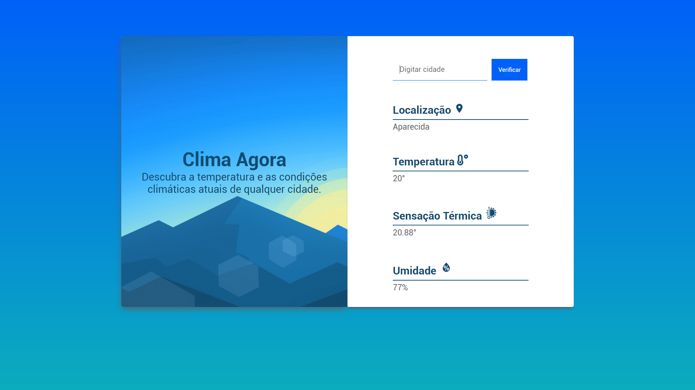

<h1 align="center">
  
<br>
Clima Agora
</h1>

<p align="center"> 🚀 A web application to search the climate conditions of any Brazil's city.</p>
 Maybe you'd like to check the <a href="https://github.com/guilhermeorcezi/ClimaAgora-mobile">Mobile Version</a> too 
<p align="center">
  <a href="https://opensource.org/licenses/MIT">
    
  </a>
</p>

## Features

- ⚛️ **React Js** — Javascript lib to create de interfaces.

## Getting started

### Frontend
To start **Frontend** using React use the commands:
```bash
yarn install
yarn start
```
Once the process is finished, the `localhost: 3000` page will automatically open in your browser with the developed application

## How to contribute
- First leave a ⭐!
- Fork the repositories in production as they are updated: <a href="https://github.com/guilhermeorcezi/todolist"> MonoRepo;</a>
- Create a branch with your feature: `git checkout -b my-feature`;
- Commit your changes: `git commit -m 'feat: My new feature'`;
- Push to your branch: `git push origin my-feature`.

## License

This project is licensed by MIT License - Go to the [licence page](https://opensource.org/licenses/MIT) to see more details.
